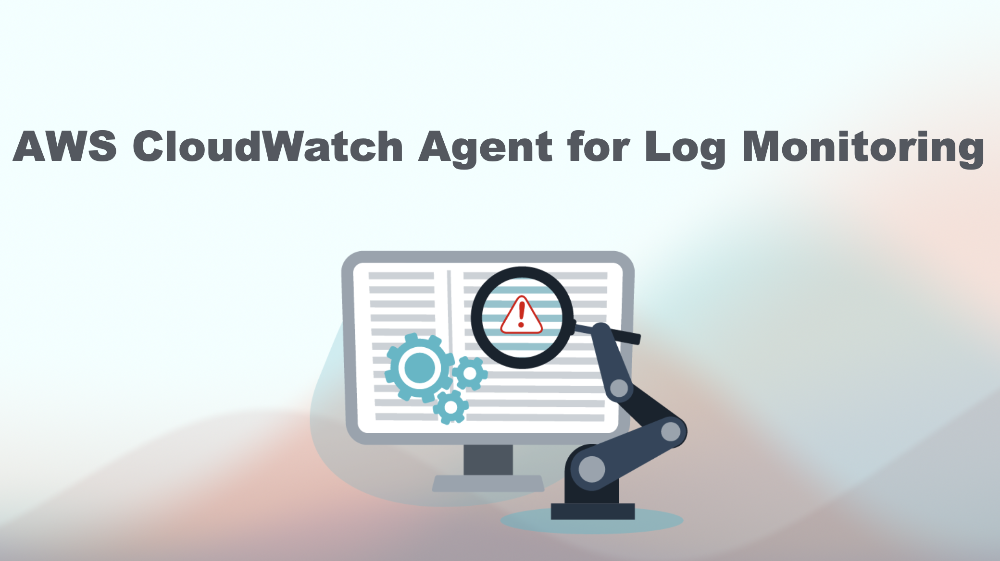
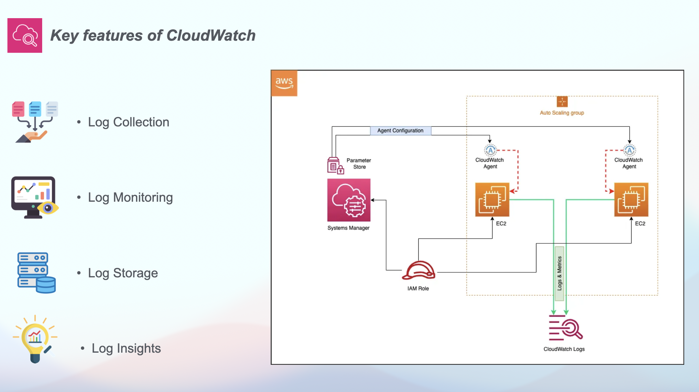
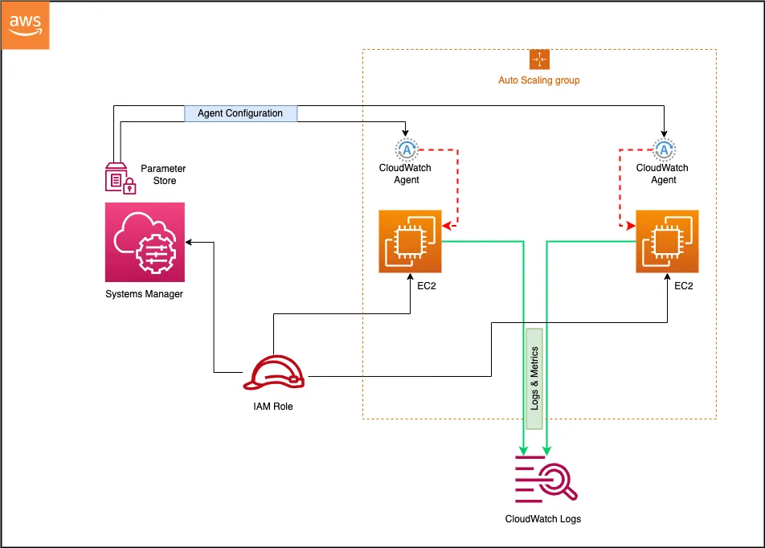

# 🚀 AWS CloudWatch Agent for Log Monitoring
[](https://www.linkedin.com/in/amine-maalej/)

[](https://www.youtube.com/@CloudTech_with_Amine)





## 🌟 Overview
AWS CloudWatch Logs is a powerful service that allows you to monitor, store, and access log files from various AWS resources. It plays a crucial role in maintaining the health and performance of your applications. In this tutorial, we’ll explore :
- **key components of AWS CloudWatch Logs**
- **step-by-step guide to setting up log monitoring for an Apache web server**

## 📝 Comprehensive Guide
For a detailed guide, please refer to the [Youtube video](https://www.youtube.com/watch?v=KfHvoIiAi2U).

## ✅ Slides

Slide 1            | Slide 2         
:------------------------:|:-----------------------:|
  | 
## 💻 Commands

```
sudo yum install httpd -y
cd /var/www/html 
```

```
sudo systemctl start httpd 
sudo systemctl enable httpd --now
```

```
sudo yum install amazon-cloudwatch-agent -y
```
```
aws ssm put-parameter --name "AmazonCloudWatch-logs" --type "String" --value file://cloudwatch-config.json
```

```
sudo /opt/aws/amazon-cloudwatch-agent/bin/amazon-cloudwatch-agent-ctl -a fetch-config -m ec2 -c ssm:AmazonCloudWatch-logs -s
```


Happy learning 📚